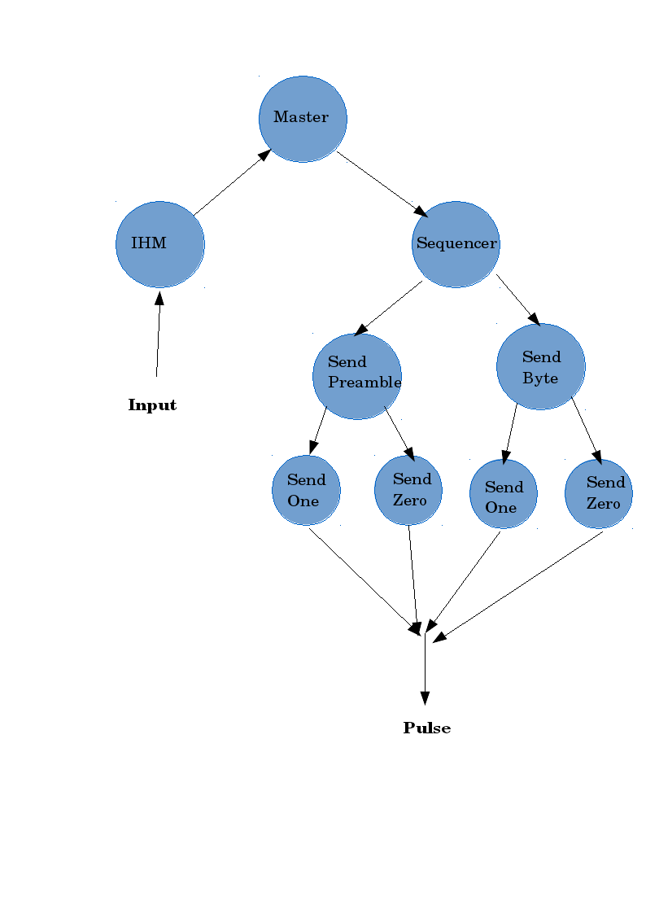
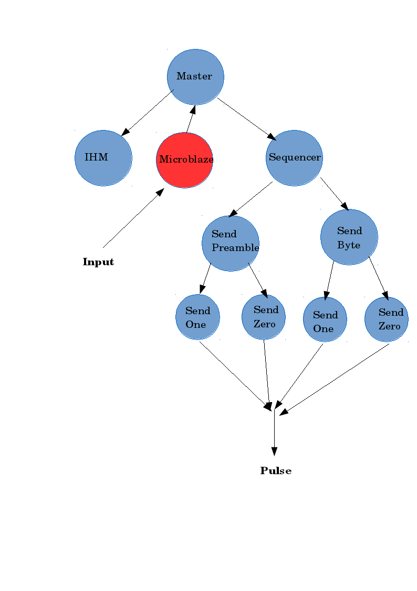
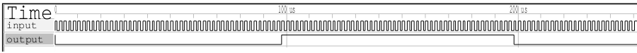
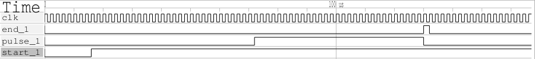
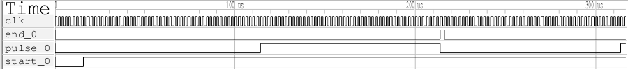
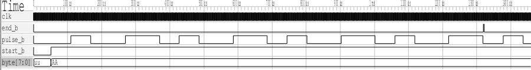
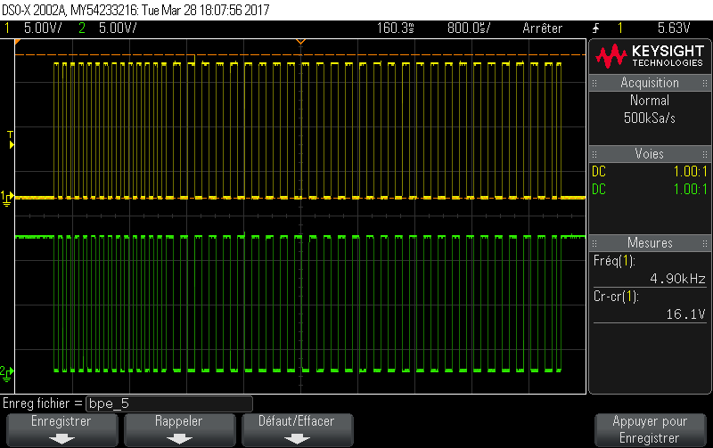
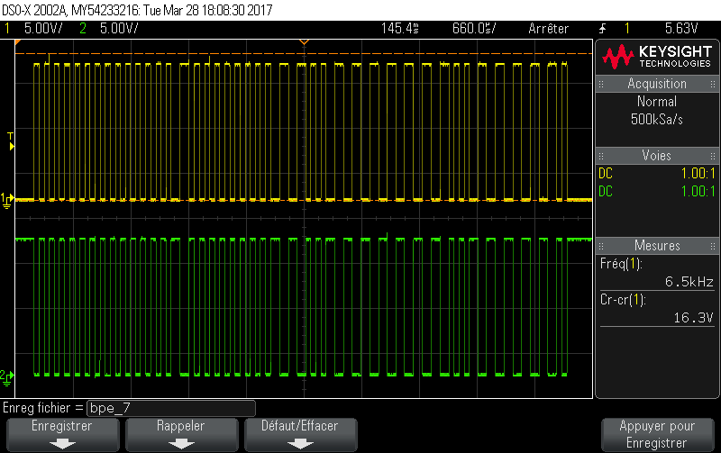

.. footer:: page ###Page###

================================
Rapport de Projet **Train** FPGA
================================

-----------------------------
FPGA 1 Systèmes programmables
-----------------------------

|
|
|
|

*Ayrault Maxime* **3203694** - *Nguyen Gabriel* **3200625**

|
|
|
|
|
|
|

----------------------------------------------------------

Introduction
============

|
|

|

| Ce document présente le rapport du projet train de l'UE *FPGA1*.
| Le projet a pour but de réaliser le circuit electrique d'une *centrale DCC* et de la 
| tester sur une vraie maquette. 
| Lors de ce Projet nous nous sommes servis du logiciel **Vivado** pour le développement de la
| centrale ainsi que de la carte **FPGA** ``Nexys 4DDR``.
| Nous avons découvert le protocole DCC, que nous avons implémenté.
|
|

Ce projet se décompose en 2 étapes qui correspondent à 2 types de centrales :
 - une uniquement en ***vhdl***.
 - l'autre en ***vhdl*** et en ***C*** en utilisant le microblaze de la carte. 

|

Ce projet a été developpé sous git :
 https://github.com/maximouth/Projet_FPGA

|
|
|
|
|
|
|
|

 

--------------------------------------------

I) Protocole DCC
================

|
| Le protocole DCC est un protocole standardisé qui permet de communiquer entre la carte 
| **FPGA** et les différents trains et équipements de voies.
| Il utilise une suite de commandes envoyées sur les rails jusqu'aux différents trains et 
| composants qui agissent en fonction de la commande qu'ils reçoivent. La locomotive peut 
| recevoir énormément de commandes différentes, klaxon, annonces d'entrée de gare, phares... 
| (voir datasheet locomotive). Elles ne seront pas toutes implémentées ici, mais pourront être
| rajoutées ultérieurement. 
|
|

.. image:: trame.png
   :scale: 250 %
   :alt: trame protocale DCC
   :align: center

|

Cette image représente une trame DCC et son contenu.
Chaque trame est composée de cette façon :

 - 14 *bit* à '1' *(préambule)*
 - 1 *octet* **d'adresse** 
 - 1 *octet* de **data**
 - 1 *octet de **CRC** *Xor* entre *adresse* et *data* *((epilogue))*

Chaque partie est séparée par un *bit* à '0'.

|
|
|
|
|
|
|
|
|
|
|
|
|
|
|
|
|
|
|

--------------------------------------------------------------------

|
|

II) Architecture
================

|

1) VHDL
#######

|

|
|

| Nous avons commencé par créer une centrale DCC uniquement en version matérielle 
| uniquement en VHDL. L'architecture réalisée est plutôt simple et est composée de différents
| éléments que nous allons détailler plus loin.

|
|

2) VHDL & C
###########

|

|
|

| Nous avons ensuite modifié la première centrale matérielle pour utiliser le microblaze de la carte.
| Le microblaze sert à gérer les différents appuis sur les boutons de l'IHM.

|
|
|
|
|
|

---------------------------------------

III) Fonctions
==============

|

1) Clock Divider
################

|

.. code:: VHDL

 entity div_clock is
  Port (
    -- 100 MHz signla
    clk : in STD_LOGIC;
    -- 1 MHz signal
    div_clock : out STD_LOGIC);
 end div_clock;
	  
	  

| La carte nexys 4 DDR tourne à 100Mhz ce qui n'est pas pratique pour gérer des signaux en
| sortie qui doivent être en ns.
| Pour simplifier le gestion du temps nous avons créer un diviseur d'horloge, qui diminue
| la vitesse de 100 MHz à 1 MHz.
| Ce qui facilite l'utilisation du protocole DCC.
|

|
|
| On voit que sur la simulation, la période de la sortie du module est 100x plus petite que
| celle de l'entrée.
| On divise bien l'horloge par 100, pour passer de 100 MHz à 1 MHz.
|

2) Send_One
################

|

.. code:: VHDL

 entity send_one is
  Port (
    clk     : in  STD_LOGIC;
    start_1 : in  STD_LOGIC := '0';
    end_1   : out STD_LOGIC := '0';
    pulse_1 : out STD_LOGIC := '0'
    );      
 end send_one;

| Ce petit module sert à envoyer un *'1'* en suivant le protocole **DCC**, c'est à dire envoyer un *'0'* 
| logique pendant **58** clock cycles suivi d'un *'1'* logique pendant **58** clock cycles.
| Il tourne à *1 Mhz* grâce au module ``clock_divider``.
|

|
|
| On observe sur la simulation qu'à partir du moment où le signal ``start_1`` passe à *'1'* le signal de 
| sortie envoie un *'0'* pendant **58**  cycles suivi d'un *'1'* pendant **58** cycles et signale que l'envoi est
| terminé par le signal ``end_1`` à  *'1'* pendant **1** cycle.

3) Send_Zero
################

|

.. code:: VHDL

 entity send_zero is
  Port (
    clk     : in  STD_LOGIC;
    start_0 : in  STD_LOGIC := '0';
    end_0   : out STD_LOGIC := '0';
    pulse_0 : out STD_LOGIC := '0'
    );      
 end send_zero;
	  

| Ce petit module sert à envoyer un *'0'* en suivant le protocole **DCC**, c'est à dire envoyer un *'0'* 
| logique pendant **100** clock cycles suivi d'un *'1'* logique pendant **100** clock cycles.
| Il tourne à *1 Mhz* grâce au module ``clock_divider``.
|

|
|
| On observe sur la simulation qu'à partir du moment où le signal ``start_0`` passe à *'1'* le signal de 
| sortie envoie un *'0'* pendant **100**  cycles suivi d'un *'1'* pendant **100** cycles et signale que l'envoi est
| terminé par le signal ``end_0`` à  *'1'* pendant **1** cycle.
|

4) Send_preamble
################

|

.. code:: VHDL

 entity send_preamble is
  Port (
    clk     : in  STD_LOGIC;
    start_p : in  STD_LOGIC := '0';
    end_p   : out STD_LOGIC := '0';
    pulse_p : out STD_LOGIC := '0'
    );      
 end send_preamble;
	  
	  

| Ce module sert à envoyer un préambule en suivant le protocole **DCC**, c'est à dire à envoyer 
| une suite de 14 *'1'*. Ce module se sert du petit module ``send_one``.
| Ce module attend de recevoir un signale **start_p** qui lui signale qu'il doit envoyer un preambule. 
| Il se sert d'un compteur initialisé à ``0`` *(signal interne)* qui sert à connaitre le nombre de *'1'* envoyé. 
| Il envoie  un **start_1** au module ``send_one`` et  attend de recevoir le signal  **end_1**
| pour incrementer le compteur.
| Une fois le preambule envoyé il renvoie le signal **end_p** qui signifie qu'il a fini.
|

.. image:: trame/send_preamble.png
   :scale: 250 %
   :alt: trame protocale DCC
   :align: center

|
|
| On observe sur la simulation que quand le signal ``start_p`` passe à *'1'* le signal de sortie 
| envoie **14** *'1'* suivant le protocole DCC.
| Une fois les  **14** *'1'* envoyés, il signale qu'il a fini avec le signal ``end_p`` à *'1'* pendant **1** cycle.
|
|

5) Send_byte
################

|

.. code:: VHDL

 entity send_byte is
  Port (
    clk     : in  STD_LOGIC;
    start_b : in  STD_LOGIC := '0';
    byte    : in  Std_Logic_Vector (7 downto 0); 
    end_b   : out STD_LOGIC := '0';
    pulse_b : out STD_LOGIC := '0'
    );      
 end send_byte;

	  
|
|
| Ce module sert à envoyer un octet en suivant le protocole **DCC**, c'est à dire envoyer 
| une suite de 8 *'1'* ou *'0'* selon la valeur de l'octet en entrée. Ce module se sert des
| petits modules ``send_one``, et ``send_zero``.
| Ce module attend de recevoir un signal **start_b** qui lui signal qu'il doit envoyer un octet. 
| Il se sert d'un compteur initialisé à ``0`` qui sert à connaitre le nombre de *bit(s)* envoyés. 
| Il envoie  un **start_0/1** à l'un des deux sous-modules et  attend de recevoir le signal
| **end_0/1** avant d'envoyer le bit suivant et incrémenter le compteur.
| Une fois l'octet envoyé il renvoie le signal **end_b** qui signifie qu'il a fini.
|

|
|
| Lors de cette simulation nous cherchons à envoyer l'octet suivant *"10101010"*. Pour cela nous
| l'avons mis dans le signal ``byte``.
| On observe sur la simulation que lorsque le signal ``start_b`` passe à *'1'* le signal de sortie 
| envoie les différentes valeurs contenues dans le signal ``byte`` c'est à dire une alternance de *'1'* et de *'0'*.
| Une fois les différents bits de l'octet envoyés, le module signale qu'il a fini avec le signal ``end_b`` à *'1'* pendant **1** cycle.
|
|

6) Sequencer
################

|

.. code:: VHDL

 entity sequencer is
  Port (
    clk       : in  STD_LOGIC;

    go        : in  STD_LOGIC := '0';
    
    addr      : in  Std_Logic_Vector (7 downto 0);
    feat      : in  Std_Logic_Vector (7 downto 0);
    speed     : in  Std_Logic_Vector (7 downto 0);
    which     : in  Std_Logic;
    idle      : in  Std_Logic;    

    done      : out Std_Logic;
    pulse     : out STD_LOGIC := '0'
    );      
 end sequencer;

| Ce module est implémenté grâce à une machine à états, qui va gérer l'envoi des 4 trames
| *(Idle, Vitesse, Fonction, Idle)*.

|
|
|
|
|
|
|
|
|

--------------------------------------------------

|
|

IV) IHM
=======

|
|
|
|
| Voici une photo de l'*IHM* de notre projet.

.. image:: exe_add.jpg
   :scale: 150 %
   :alt: photo de l'interface
   :align: center

|
|                                      *Photo de l'interface*
|
|

Les *afficheurs 7 segments* sont découpés en 2 :

 - Les 4 de **gauches** servent à afficher le nom de la commande. 
 - Les 4 de **droites** servent à afficher la valeur de la commande. 

|

On utilise **3** *boutons* sur les 5 :

 - Le bouton de **gauche** pour changer la commande.
 - Le bouton de **droite** pour incrémenter la valeur de la commande
   affichée.
 - Le bouton du **milieu** pour envoyer les nouvelles valeurs entrées vers
   le module ``Master``

|

Le switch de droite sert de reset, c'est un reset actif haut.   

|
|
|
|
|
|
|
|
|
|
|
|
|
| Voici l'interface de notre IHM

.. code:: VHDL

 entity control_seg is
  Port ( CLK    : in STD_LOGIC;
         reset  : in STD_LOGIC;
         CA     : out STD_LOGIC;
         CB     : out STD_LOGIC;
         CC     : out STD_LOGIC;
         CD     : out STD_LOGIC;
         CE     : out STD_LOGIC;
         CF     : out STD_LOGIC;
         CG     : out STD_LOGIC;
         DP     : out STD_LOGIC;
         AN     : out STD_LOGIC_VECTOR (7 downto 0);
         ADD    : out STD_LOGIC_VECTOR (7 downto 0);
         SPD    : out STD_LOGIC_VECTOR (7 downto 0);
         FEAT   : out STD_LOGIC_VECTOR (7 downto 0);
         -- chose setting
         BTNL   : in STD_LOGIC;
         -- increment setting value
         BTNR   : in STD_LOGIC
         );
 end control_seg;

|
|
| Voici l'interface de notre IHM.

Elle reçoit :

 - En entrée la clock et le reset, ainsi que la valeur des différents boutons.
 - En sortie les différents fils servant à contrôler les afficheurs
   *CA*->*CG* *DP* *AN* ainsi que les valeurs courantes des octets
   d'adresse, de vitesse et de la commande.

|
|
|
|
|
|
|
|
|

-------------------------------

|
|
|
|
|
|
|
|

V) Implémentation sur la maquette
=================================

|
|

.. code:: VHDL

 entity Master is
  Port ( CLK   : in STD_LOGIC;
         BTNC  : in STD_LOGIC;
         BTNL  : in STD_LOGIC;
         BTNR  : in STD_LOGIC;
         reset : in STD_LOGIC;
         LED   : out STD_LOGIC;
         CA    : out STD_LOGIC;
         CB    : out STD_LOGIC;
         CC    : out STD_LOGIC;
         CD    : out STD_LOGIC;
         CE    : out STD_LOGIC;
         CF    : out STD_LOGIC;
         CG    : out STD_LOGIC;
         DP    : out STD_LOGIC;
         AN    : out Std_Logic_Vector (7 downto 0);
         PULSE : out STD_LOGIC);

 end Master;

	  

| 
| Le module ``interface`` envoie en permanence vers le module ``Master`` la valeur courante des différentes commandes.
| Le module ``Master`` ne mets à jour les valeurs à envoyer vers le train que lorsqu'il détecte un appui
| sur le bouton central. Dans ce cas la valeur locale des commandes est mise à jour .
|
Il envoit par contre en continue un groupe de 4 trames vers le(s)
train(s) :

 - IDLE  : Ne fait rien
 - SPEED : Envoi la valeur de la vitesse au train choisi
 - FEAT  : Envoi la commande au train choisi
 - IDLE  : Ne fait rien

|
| Ce module sert en fait à disperser les differents fils arrivant en entrée ou en sortie vers les
| différents composants.
|
|
|
|
|
|
|
|
|
|

|
| Sur cette image nous voyons une image d'oscilloscope montrant une trame de vitesse.
On peut observer :

 - les 14 bits à *'1'* du préambule,
 - l'octet d'adresse qui correspond à l'adresse *0x0*
 - l'octet de vitesse à *0x0* (vitesse nulle)
 - l'octet de CRC egal à *0x0* (**xor** entre adresse et vitesse)

|
|

|
| Sur cette image nous voyons une image d'oscilloscope montrant une trame **IDLE**.
On peut observer :

 - les 14 bits à *'1'* du préambule,
 - l'octet d'adresse qui correspond à l'adresse *0xFF* (adresse vers rien)
 - l'octet de vitesse à *0x0* (vitesse nulle)
 - l'octet de CRC egal à *0xFF* (**xor** entre adresse et vitesse)

|
|

Nous avons implementé differents fonctionalité pour les différents trains :

 - 8 vitesses
 - allumage/extinction des phares de le locomotive.
 - un klaxon
 - le bruit de moteur

|
|

image maquette

.. image:: maquette.png
   :scale: 100 %
   :alt: photo maquette
   :align: center

-------------------------------
	   
VI) Microblaze
==============

| Le microblaze est un petit microcontroleur intégré sur la carte ``Nexys 4 DDR``. On  va s'en servir 
| ici pour integer une de nos ``IP`` à  la centrale existante.
| Cette ``IP`` se chargera de la gestion des différents boutons, et  remplacera une partie de 
| notre ``IHM``. Rajouter cette fonctionalitée va nous permettre de voir comment faire une architecture
| *hybride matérielle logicielle*.
| 
| Voici le schema que nous allons utiliser comme interface entre le  ``microblaze`` et notre ``IP``.
|

.. image:: IP.png
   :scale: 100 %
   :alt: photo maquette
   :align: center

| Cette IP recupère la valeur en entrée des boutons et va écrire une valeur spéciale dans des 
| registres pour signaler qu'il y a eu un appuis à la centrale.	   

.. code:: c

 Le code C de l'ip
 .
 .
 .

---------------------------------------------------------

VII) Conclusion
===============

| Nous avons réussit à mettre en place les **deux centrales**. Une *matérielle*, l'autre *hybride*.
| Les deux permettent de faire bouger une ou plusieures *locomotives* sur la maquette et
| de leur permettre de de réaliser plusieurs actions.
|
| Les **deux centrales** crées nous ont permis de nous apercevoir qu’il est important d’utiliser ou
|  non la carte ``microblaze`` si l'on veut plus de possibilitées de *modulation*.
| Le ``microblaze`` permet de modifier le comportements de l'application sans forcement modifier
| la partie *matérielle*.
