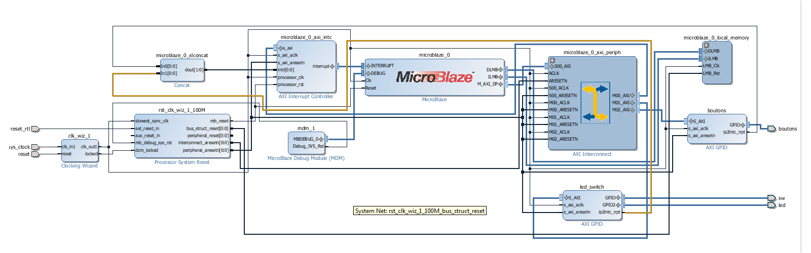
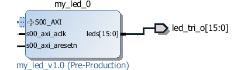

.. footer:: page ###Page###

==================
Rapport de TP FPGA
==================

-----------------------------
FPGA 1 Systèmes programmables
-----------------------------

|
|
|
|

*Ayrault Maxime* **3203694** - *Nguyen Gabriel* **3200625**

|
|
|
|
|

----------------------------------------------------------

Introduction
============

|
|
|
|
|
|
|
|
|
|
|
|
|
|
|
|
|
|
|
|
|
|
|
|
|
|
|
|
|
|
|

TP 1
====

**Synthèse VHDL sur FPGA**

|

Le double objectif de ce TP est de :
 * Prendre en main la chaîne de conception **Xilinx Vivado** ainsi que
   la carte FPGA **Nexys 4 DDR** sur laquelle nous travaillerons.
 * De comprendre comment fonctionne l'outil de synthèse de *Vivado* et
   de quelle façon il va interpréter un code **VHDL** imprécis ou erroné.

|

|I. prise en main du modèle
---------------------------

|

3) Création d'un module VHDL
~~~~~~~~~~~~~~~~~~~~~~~~~~~~

Dans cette première partie nous allons créer un module permettant
d'allumer des **LEDS** selon la valeur des *interrupteurs* se trouvant sur la carte.

|

.. code:: VHDL

 entity TEST is 
    Port (  -- input signal, switch 0
            SW0 : in STD_LOGIC;       
	    -- input signal, switch 1
	    SW1 : in STD_LOGIC;       
	    -- input signal, switch 2
	    SW2 : in STD_LOGIC;       
	    -- output signal the first 3 leds of the board
	    LED : out STD_LOGIC_VECTOR (2 downto 0) 
           ); 
 end TEST; 

 architecture Behavioral of TEST is 
 begin 
   -- when switch 0 is on - led 0 is on
   LED(0) <= SW0;
   -- when switch 1 is on - led 1 is on
   LED(1) <= SW1; 
   -- when the three switchs are all on - all the led are on too
   LED(2) <= SW0 and SW1 and SW2; 
 end Behavioral;

|
|
|
|
|
|
|

4) Testbench et simulation avec Modelsim
~~~~~~~~~~~~~~~~~~~~~~~~~~~~~~~~~~~~~~~~

Voici le *chronogramme* de la simulation de notre programme précédent.

.. image:: chrono_TP1.png
   :scale: 75 %
   :alt: chronogramme du programme du 3)
   :align: center

|

On peut remarquer que les bits de sortie (*LED*) correspondent bien à
ce que l'on cherchait à faire.
	   
|
|
|

----------------------------

|
 
|II. Cas d'études-Synthèse VHDL
-------------------------------

| Nous avons séparé cette étude en **4 parties** distinctes, les 3 premières parties sont composées d'un petit système permettant de réaliser une fonction simple.
| Dans la dernière partie de cette étude nous allons tout regrouper en un seul bloc ce qui permettra d'effectuer toutes les actions.
|

1) Compteurs imbriqués
~~~~~~~~~~~~~~~~~~~~~~

| Le fichier ``Test_CPT`` permet d'instancier une petite structure comprenant deux *compteurs*
| et une gestion de l'affichage des 4 premières **LEDS**.
|
| Un Premier compteur *Cpt* inverse la valeur du signal ``start`` une fois tous les
| *20000000 cycles*, il est initialisé à ``'0'``.
|
| A chaque fois que le signal ``start`` vaut ``'1'`` le compteur *Cpt2* (sur 28 bits) est incrémenté.

Il y a deux mode pour l'affichage sur les **LEDS**
 * Le *bouton gauche* est appuyé -> Les 4 **LEDS** de gauches de la carte
   sont allumées.

 * Le *bouton gauche* est relâché -> Affichage des 4 MSB de CPT2 sur les
   4 premières **LEDS**.

|
|

Il y avait plusieurs *erreurs* dans le code qui l'empêchaient de
fonctionner normalement :
 * Le compteur *CPT* ne etait borné a ``20000000`` et la valeur de seuil
   pour declencher le signal start etait de ``70000000``, *CPT* ne
   l'atteignait jamais.

|
|
|
|

Code corrigé:
   
.. code:: VHDL

 entity Test_CPT is 
    Port ( -- Clock
           Clk : in  STD_LOGIC;
	   -- Asynchronous Reset
	   Reset : in  STD_LOGIC;
	   -- Left Button
           Button_L : in  STD_LOGIC;
	   -- The 4 output for the LED
	   LED : out  STD_LOGIC_VECTOR (3 downto 0));	-- LED de sortie 
 end Test_CPT; 

 architecture Behavioral of Test_CPT is 

 -- modulo N counter
 signal Cpt: integer range 0 to 20000000;
 -- 28 bits counter
 signal Cpt2: std_logic_vector(27 downto 0);
 -- start signal
 signal start: std_logic;				                       -

 begin 
   ------------------------------
   -- Gestion Cpt et Start -- 
   ------------------------------ 
   process(Clk,Reset) 
   begin 

   
     if Reset = '1' then
       -- Asynchronous Reset
       Cpt <= 0;
       start <='0';
       
     if rising_edge(Clk) then

       -- increment Cpt
       Cpt <= Cpt + 1;
		 
       -- if the bound limit is reach
       if Cpt = 20000000 then -- *** Correction de 20000000 au lieu de 70000000 ***        
         -- invert start level
         start <= not start;  
	 -- Reset Cpt
         Cpt <= 0;
       end if; 
     
     end if; 
   end process; 

|

.. code:: VHDL
   
   ----------------------
   -- Gestion CPT2  
   ---------------------- 
   process(Clk,Reset) 
   begin 
	 
    -- Asynchronous Reset
    if Reset = '1' then
	  Cpt2 <= (others => '0'); 
    end if;

    if rising_edge(Clk) then 

      if start = '1' then
	-- increment Cpt2 when start signal equal '1'
        Cpt2 <= Cpt2 + 1;
      end if; 

    end if; 
   end process; 

|

.. code:: VHDL
	  
   ------------------ 
   -- Gestion LED
   ------------------ 
     -- Bouton Relâché --> Affichage des 4 MSB de CPT2 
     -- Bouton Appuyé  --> Les 4 LED sont Allumées 

     LED <= Cpt2(27 downto 24) when Button_L='0' else "1111";
     
 end Behavioral; 

|

2) Compteur d'impulsions
~~~~~~~~~~~~~~~~~~~~~~~~

| Le fichier ``Test_Impulse`` permet d’instancier une petite structure permettant d'utiliser
| deux boutons. le *bouton de gauche* sert à incrémenter la valeur de notre compteur, celui du
| *centre* sert à le décrémenter.
| Le compteur est un compteur sur **4 bits** dont la valeur est affichée en binaire sur les 4 premières 
| **LEDS** de la carte. Il y a aussi la **LED** 15 qui s'allume une fois que la valeur définie comme seuil est
| dépassée.
|
| Lors de l'implémentation, nous avons remarqué que la fonction écrite dans le fichier VHDL ne pouvait pas fonctionner car
| la synchronisation est faite par 2 signaux (*Button_L* et *Button_C*) ce qui n'est pas possible.
|
| Nous avons aussi rencontré un problème de fréquence. En effet la carte tournant à *100MHz* nous 
| ne pouvions pas gérer notre compteur seulement par l'appui que nous faisions sur celui ci.
| Nous avons donc introduit des ``stamps`` pour gérer le temps entre deux appuis. Chaque
| stamp a servi à limiter le temps entre deux appuis consécutifs reconnus dans l'implementation. La vitesse
| d'incrémentation du compteur est donc bloquée à 1 appui toutes les secondes.

|
|

Code corrigé:
   
.. code:: VHDL

 entity IMPULSE_COUNT is 
   Port ( -- clock 
	  Clk      : in STD_LOGIC;
	  -- Reset Asynchrone
	  Reset    : in  STD_LOGIC;
	  -- Leds Values
          Count    : out  STD_LOGIC_VECTOR (3 downto 0);
	  -- Indicateur Valeur Seuil 
	  Sup      : out  STD_LOGIC;
	  -- Center Button
	  Button_C : in  STD_LOGIC;
	  -- Left   Button 
	  Button_L : in  STD_LOGIC);				      
 end IMPULSE_COUNT; 

 architecture Behavioral of IMPULSE_COUNT is 

   -- Impulse counter
   signal cpt : std_logic_vector(3 downto 0);
   -- Signal to avoid bounce for left button
   signal stamp1 : integer range 0 to 100000000; 	                   
   -- Signal to avoid bounce for center button
   signal stamp2 : integer range 0 to 100000000;	                   
    
  begin 

    -- put the cpt value as led value
   count <= cpt;
  
   
   process(reset, clk) 
   begin 

      -- Asynchrnous Reset
      if reset='1' then
	  cpt<="0000";
      end if;

            
      if rising_edge (clk) then
	  -- Increment stamp1 
	  stamp1 <= stamp1 + 1;                                                
          -- Increment stamp2
	  stamp2 <= stamp2 + 1;

	  -- if left button is hit and at the right timming
          if Button_L = '1' and stamp1 > 20000000 then 
	     -- Reset stamp1 
	     stamp1 <= 0;
	     -- increment cpt value
	     cpt<=cpt+1; 
          end if; 

	  -- if center button is hit and at the right timming
          if Button_C = '1' and stamp2 > 20000000 then 
	     -- Reset stamp1 
	     stamp2 <= 0; 
	     -- decrement cpt value
	     cpt<=cpt-1; 
          end if; 
          
     end if;           
  end process; 
    
  process(Cpt) 
  begin 
             
    -- if cpt is greater than 9 then sup output is equal to 1
    if (cpt > 9) then
       Sup<='1';
    else 							 
      Sup<='0'; 
    end if; 
  end process; 
  
 end Behavioral;

|

3) Décodeur
~~~~~~~~~~~

| Le fichier ``Selector`` permet d'instancier un décodeur qui prend en entrée les signaux
| de sortie (*sup* et *cout*) du fichier impulse_Count, et initialise le signal *Limit* qui affichera
| différents motifs sur les 16 **LEDS** en fonction de ces deux signaux.
|
| Il y a eu des erreurs de compilation car dans le fichier initial toutes les conditions
| du ``case`` n'étaient pas déclarées. Il a fallu retirer le commentaire indiquant
| ``when others => NULL`` pour résoudre ce problème. il a aussi fallu rajouter au niveau de
| l'initialisation des valeurs du signal *Decode*, la ligne suivante ``else "00"``.

|
|

Code corrigé:
   
.. code:: VHDL

   entity Selector is 
   Port (-- Clock 
	  Clk : in  STD_LOGIC;						
	  -- Asynchronous Reset 
	  Reset : in  STD_LOGIC;					        
	  -- Right Button 
	  Button_R: in STD_LOGIC;						
	  -- Compteur d'entré 
	  Count : in  STD_LOGIC_VECTOR (3 downto 0);	                        
	  -- Valeur Seuil 
	  Sup : in  STD_LOGIC;
	  -- Bound Value  
	  Limit : out  STD_LOGIC_VECTOR (27 downto 0));	            
   end Selector; 

   architecture Behavioral of Selector is 

     -- Commande du Decodeur 
     signal Decode: std_logic_vector(1 downto 0);        			     

   begin 

   ---------------------------
   -- Gestion du Décodeur 
   --------------------------- 
      process(Clk,Reset) 
      begin 

	  -- Reset Asynchrone 
	  if Reset = '1' then
	     Limit <= (others =>'0'); 
	  
	     
	  -- Si On A un Front d'Horloge 
	  elsif rising_edge (Clk) then 

	    -- Si On Appuie sur le Bouton Right 
	    if Button_R = '1' then 

	  -- Signification de Limit (Pour la Machine à États de la Suite du TP) 
	  -- Les 2 MSB définissent le Mode de Clignotement 
	  -- 00 --> 	**LEDS** Toujours Éteintes 
	  -- 10 --> 	Clignotement des **LEDS** 
	  --	            La Fréquence de Clignotement 
	  --		Dépend des LSB de Limit 
	  --		24 Millions --> 1 fois par Seconde 
	  --	            8 Millions --> 3 fois par Seconde 
	  -- 11	-->	**LEDS** Toujours Allumées 

	       case (Decode) is 

	         when "00" => Limit <= (others => '0'); 
	         when "01" => Limit <= X"96E3600";-- 24 000 000 en Décimal 
	         when "10" => Limit <= X"87A1200";-- 8 000 000 en Décimal 
	         when "11" => Limit <= (others => '1');
	         when others => NULL;

              end case; 
	    end if; 
	  end if; 

      end process; 

           -- Si Count > 9       --> Decode = 11
      Decode <= "11" when Sup = '1'
           -- Si Count = 6,7,8,9 --> Decode =10
	   else "10" when Count > 5	
	   -- Si Count = 3,4,5   --> Decode = 01 
	   else "01" when Count > 2	
	   -- Si Count = 0,1,2   --> Decode = 00 
	   else "00";		

  end Behavioral;

|
|

4) FSM
~~~~~~

| Dans cette étape le but est d'implémenter une **machine à état** qui va permettre
| de gérer les différents états des **LEDS** (éteintes, allumées ou clignotement).

  
|
|

Code corrigé:
   
.. code:: VHDL

  entity FSM is 
  Port ( --Horloge 
	 Clk : in  STD_LOGIC;				           
	 --Reset Asynchrone 
	 Reset : in  STD_LOGIC;
	 --Mode d'Affichage des **LEDS** 
	 Mode : in  STD_LOGIC_VECTOR (1 downto 0);	           
	 --Seuil du Compteur pour Vitesse
	 Seuil : in  STD_LOGIC_VECTOR (25 downto 0);              
	 --Commande des **LEDS** 
	 LED : out  STD_LOGIC_VECTOR (3 downto 0));	           
   end FSM; 

   architecture Behavioral of FSM is 

   -- Compteur de Temporisation 
   signal cpt: integer range 0 to 24000000;				

   -- FSM States
   type etat is (LED_OFF, CLIGN_OFF, LED_ON, CLIGN_ON);	
   -- État Présent, État Futur 
   signal EP,EF: etat;							

   begin 

   ----------------------------------------------- 
   -- Gestion du Compteur de Temporisation 
   ----------------------------------------------- 

   process(Clk,Reset) 
   begin 
	  
      -- Reset Asynchrone 
      if Reset='1' then
         Cpt <= 0; 
	  
      -- Si on A un Front d'Horloge... 
      elsif rising_edge(Clk) then 
	  
         -- Si On Est en Mode Clignotement, le Compteur s'incrémente 
         if (EP = CLIGN_OFF) or (EP = CLIGN_ON) then 
            Cpt <= Cpt + 1; 
         -- Sinon, on Remet le Compteur à 0 
         else 
	    Cpt <= 0; 
	    end if; 
	    end if; 
	    end process; 
	  
   --------------------------- 
   -- MAE - Registre d’État 
   --------------------------- 

   process(Clk,Reset) 
   begin 

	  -- Reset Asynchrone 
	  if Reset = '1' then
	     EP <= LED_OFF;          

	  -- Si on a un Front d'Horloge 
	  elsif rising_edge (Clk) then                     
	     -- Mise à Jour du Registre d'Etat 
	     EP <= EF;                         
	  end if;
   end process; 
	  
   -------------------------------------------------- 
   -- MAE - Évolution des États et des Sorties
   ------------------------------------------------- 
   process(Cpt,EP,Mode,Seuil) 
   begin
   
     -- Par Défaut les **LEDS** sont Éteintes 
     LED <= "0000";                                                    
	  
     ----------------------------------------------------------------- 
     -- 	Modes de Fonctionnement				
     --		Mode = 00 --> **LEDS** Éteintes 					
     --		Mode = 10 --> **LEDS** Clignotent				
     --		Mode = 11 --> **LEDS** Allumées					
     ----------------------------------------------------------------- 
	  
     case (EP) is 
	  
        -- **LEDS** Éteintes 
	-- On Reste dans cet État Tant que Mode est à 00 
	-- Si Mode Passe à 10, On Passe en **LEDS** Clignotement 
	-- Si Mode Passe à 11, On Passe en **LEDS** Allumées 

	  when LED_OFF	=> LED <= "0000";
          --Rajout de la valeur en sortie 
	                   if Mode = "10" then
			      EF <= CLIGN_OFF; 
	                   elsif Mode = "11" then
			      EF <= LED_ON; 
	                   end if; 
	  
	  -- **LEDS** Clignotement - (Eteint) 
	  -- Le Compteur Compte Jusqu'au Seuil puis on Passe à l'Etat Suivant 
	  when CLIGN_OFF	=>  LED <= "0000";
          --Rajout de la valeur de sortie 
	                   if Mode = "00" then
			      EF <= LED_OFF; 
                           elsif Mode = "11" then
			      EF <= LED_ON; 
                           end if; 
                           if Cpt = Seuil then
			      EF <= LED_ON; 
                           end if; 

	  -- **LEDS** Allumées 
	  -- On Reste dans cet état tant que Mode est à 11 
	  -- Si Mode Passe à 10, On Passe en **LEDS** Clignotement 
	  -- Si Mode Passe à 00, On Passe en **LEDS** Éteintes  
	  when LED_ON	=> LED <= "1111"; 
	                   if Mode = "10" then
			      EF <= CLIGN_ON; 
			   elsif Mode = "00" then
			      EF <= LED_OFF; 
			   end if; 

	  -- **LEDS** Clignotement - (Allumé) 
	  -- Le Compteur Compte Jusqu'au Seuil puis on Passe à l’état Suivant 
	  when CLIGN_ON	=> LED <= "1111"; 
	                   if Mode = "00" then
			      EF <= LED_OFF; 
			   elsif Mode = "11" then
			      EF <= LED_ON; 
			   end if; 
			   if Cpt = Seuil then
			      EF <= LED_OFF; 
			   end if; 
	end case; 
     end process; 

   end Behavioral;

|

------------------------------
   

TP 2
====

**Codesign Materiel/Logiciel**

| L'objectif de ce TP est d'implémenter puis de programmer un système mixte matériel/logiciel sur
| le **FPGA**. Ce système sera basé sur le processeur embarqué *Microblaze* de *Xilinx*.

Le développement sera réalisé grâce aux outils suivants :
 * Le mode **IP Integrator** de *Vivado* pour la génération de la
   plate-forme matérielle.
 * **SDK (Software Development Kit)** pour le développement et
   l'exécution de l'application logicielle.

|
|

|II. Spécification de la plate-forme matérielle
-----------------------------------------------

| Voici *l'architecture* que nous avons créée et que nous allons utiliser lors de ce TP.

|
|

|III. Développement de l'application logicielle
-----------------------------------------------

Sûrement qq chose à mettre la.
Le fichier .xdc ou quoi

|V. Développement de l'application logicielle
---------------------------------------------

| Dans cette exercice nous devions écrire un *programme C* qui doit être exécuté sur le microcontrôleur
| ``Microblaze`` afin d'allumer les **LEDS** en actionnant les interrupteurs.

|
|

Code écrit:
   
.. code:: C

   #include "xgpio.h" 
   #include "xparameters.h" 

   int main (int argc, char **argv ) { 

	  /* déclarer GPIO */
	  XGpio led, button;
          /* registre lecture écriture sur 32 bits */ 
	  u32 lecture = 0;
          /* initialiser la struct XGPIO */
	  XGpio_Initialize (&led, 1);
	  /* fixer la direction des switch */
	  XGpio_SetDataDirection (&led, 1, 1);
	  /* fixer la direction des led */ 	  
	  XGpio_SetDataDirection (&led, 2, 0);
	  

	  while (1) { 
	      /* lire la valeur des 4 switchs */ 
	      lecture = XGpio_DiscreteRead (&led, 1);
	      /* écrire la valeur lu */
	      XGpio_DiscreteWrite (&led, 2, lecture);        
	  } 
     return 0;
   } 
	  
|
|
|

Une fois cette partie réaliser nous devions modifier notre programme
pour que :
 * Les **LED** clignotent si **l'interrupteur** 0 est relevé, sinon
  elles affichent un motif fixe .
 * Si **l'interrupteur** 1 est relevé alors :
   
   * Si on appuie sur le **bouton Left**, les 4 **LEDS** de gauche s'allument.
   * Si on appuie sur le **bouton Right**, les 4 **LEDS** de gauche
     s'éteignent.
   * Si on appuie sur le **bouton Center**, on incrémente un compteur
     modulo 16 qui s'affiche sur les 4 **LEDS** de droite. Nous avons
     réfléchi notamment à la gestion des rebonds des boutons.
|

Code écrit:
   
.. code:: C

  int i = 0;
  int cpt;
  
  /* declarer GPIO */
  XGpio led, button;
  /* registre lecture ecriture  */
  u32 lecture = 0, ecriture = 0;
  
  /* initiliser la struct XGPIO led/switch */
  XGpio_Initialize (&led, 1);
  
  /* initiliser la struct XGPIO  boutons */
  XGpio_Initialize (&button, 0);
  
  
  /* fixer la direction des switch (entrée) */
  XGpio_SetDataDirection (&led, 1, 1);
  
  /* fixer la direction des led (sortie) */
  XGpio_SetDataDirection (&led, 2, 0);
  
  /* fixer la direction des bouton (entrée) */
  XGpio_SetDataDirection (&button, 1, 1);
  
   while (1) {
   
     /*  lire la valeur des 4 switchs  */
     lecture = XGpio_DiscreteRead (&led, 1);
   
     if ( (lecture & 0x1) == 1) {
       /* si interrupteur 0 est levé */
   
       /* ecrire un motif sur led */
       XGpio_DiscreteWrite (&led, 2, 0xF);
   
   
       for ( i = 0 ; i < 5000000000 ; i++) {}
       
       /* ecrire un motif sur led */
       XGpio_DiscreteWrite (&led, 2, 0x0);
       
       
     } else if ( ((lecture>>1) & 0x1) == 1   ){
       /* si intterupteur 1 est levé*/

       /*  lire la valeur des 4 switchs  */
       lecture = XGpio_DiscreteRead (&button, 1);

       
       /* si bouton droit appuyé */
       if (lecture & 0x1 == 1) {
         /* eteindre les led */
         XGpio_DiscreteWrite (&led, 2, 0x1);
       }
       
       /* si bouton gauche appuyé */
       else if ( ((lecture >> 1) & 0x1  == 1) ) {
         /* allumer les led */
         XGpio_DiscreteWrite (&led, 2, 0xF);
       }
   
       /* si bouton du centre appuyé */
       else if  ((lecture >> 2) & 0x1 == 1) {
         /* incrementer cpt */
         cpt = (cpt + 1) % 16;
         XGpio_DiscreteWrite (&led, 2, cpt);
       }

     } else {
       /* le reste */
       /* ecrire un motif sur led */
       XGpio_DiscreteWrite (&led, 2, 0x3);
     }
   }
   return 0;
 }

  

|VI. Utilisation du contrôleur d'interruption
---------------------------------------------

|

| Nous allons à présent utiliser les **boutons poussoirs** en mode **interruption.**
| Voici le code que nous avons écrit pour cela :

.. code:: C

 int main (int argc, char **argv ) {

 int cpt = 0;

 /* registre lecture ecriture  */
 u32 ecriture = 0;

 /* Initialize the interuption */
 XIntc_Initialize (&Intc, INTERUPT_ID);
 
 /* initiliser la struct XGPIO led/switch */
 XGpio_Initialize (&led, 1);
 
 /* initiliser la struct XGPIO  boutons */
 XGpio_Initialize (&button, BUTTON_ID);
 
 
 /* fixer la direction des switch (entrée) */
 XGpio_SetDataDirection (&led, 1, 1);
 
 /* fixer la direction des led (sortie) */
 XGpio_SetDataDirection (&led, 2, 0);
 
 /* fixer la direction des bouton (entrée) */
 XGpio_SetDataDirection (&button, 1, 1);
 

 GpioIntrExample (&Intc, &button, BUTTON_ID, INTERUPT_CHANNEL, INTERUPT_CHANNEL);
 
 
 while (1) {
 
   /*  lire la valeur des leds  */
   lecture = XGpio_DiscreteRead (&led, 1);
 
   if ( (lecture & 0x1) == 1) {
    /* si interrupteur 0 est levé */
 
	  /* ecrire un motif sur led */
	  XGpio_DiscreteWrite (&led, 2, 0xF);
    
	  delay(led);
	  
	  /* ecrire un motif sur led */
	  XGpio_DiscreteWrite (&led, 2, 0x0);
	  
	  delay(led);
	  
	  
	  
    } else if ( ((lecture>>1) & 0x1) == 1   ){
       /* si intterupteur 1 est levé*/
       
       /* si bouton droit appuyé */
       if (IntrFlag == 1) {
         IntrFlag = 0;
         /* eteindre les led */
         XGpio_DiscreteWrite (&led, 2, 0x1);
       }
       
       /* si bouton gauche appuyé */
       else if ( (IntrFlag == 2) ) {
         IntrFlag = 0;
         /* allumer les led */
         XGpio_DiscreteWrite (&led, 2, 0xF);
       }
   
       /* si bouton du centre appuyé */
       else if  (IntrFlag == 3) {
         IntrFlag = 0;
         /* incrementer cpt */
         cpt = (cpt + 1) % 16;
       
         XGpio_DiscreteWrite (&led, 2, cpt);
       
         delay (led);
       }
       
       } else {
         /* le reste */
         /* ecrire un motif sur led */
         XGpio_DiscreteWrite (&led, 2, IntrFlag);//0x3);
       }
       
       }
       return 0;
 }

|
|
|

------------------------------

   

TP 3
====

**Conception d'IP pour le Microblaze**

|

| L'objectif de ce TP est de réaliser une **IP** destinée à être connectée au **Microblaze**,
| en remplacement du contrôleur de **LED**. Le système ainsi généré sera programmé pour réaliser quelques
| exemples d'applications.

Comme pour la partie précédente, le développement sera réalisé grâce
aux outils **Xilinx** :
 * **Vivado** pour le développement de l'IP et la génération de la
   plate-forme matérielle.
 * **SDK (Software Development Kit)** pour le développement et
   l'exécution de l'application logicielle.

|

|I. Création d'une IP contrôleur de LED
---------------------------------------

|
|

Nous avons commencé ce TP en créant une nouvelle **IP**, ceci pour nous
permettre de gérer les différentes **LEDS**.

| Voici le module *VHDL* **my_led.vhd** qui a été rajouté à notre **IP**, qui allume les **LEDS**
| 4 par 4 selon le(s) switch levé(s).
|
|

.. code:: VHDL

 library IEEE;
 use IEEE.STD_LOGIC_1164.ALL;

 entity myip_led is
  port (
    sw_state : in Std_Logic_vector (3 downto 0);
    led : out Std_Logic_Vector (15 downto 0)
    );
 end myip_led;

 architecture behavioral of myip_led is 
 begin
  
  led (3 downto 0)   <= "1111" when sw_state(0) = '1' else "0000";
  led (7 downto 4)   <= "1111" when sw_state(1) = '1' else "0000";
  led (11 downto 8)  <= "1111" when sw_state(2) = '1' else "0000";
  led (15 downto 12) <= "1111" when sw_state(3) = '1' else "0000";
  
 end behavioral;       

|

| Voici aussi les différents parties des fichiers **my_led_v1_0.vhd** et  **my_led_v1_0_S00_AXI.vhd** 
| que nous avons modifiés.

|

**my_led_v1_0.vhd**

.. code:: VHDL

   port (
     -- Users to add ports here
   
     led : out Std_Logic_Vector (15 downto 0);

   -- User ports ends
     -- Do not modify the ports beyond this line
	  
|

.. code:: VHDL
	  
   -- component declaration
   component myip_led_v1_0_S00_AXI is
   generic (
     C_S_AXI_DATA_WIDTH	: integer	:= 32;
     C_S_AXI_ADDR_WIDTH	: integer	:= 4
   );
   port (
     led        : out Std_Logic_Vector (15 downto 0);
     S_AXI_ACLK	: in std_logic;
     .
     .
     
|

.. code:: VHDL

   port map (
     led                => led,
     S_AXI_ACLK	        => s00_axi_aclk,
     S_AXI_ARESETN	=> s00_axi_aresetn,
     .
     .

|
|

**my_led_v1_0_S00_AXI.vhd**

.. code:: VHDL

   port (
     -- Users to add ports here
     
     led : out Std_Logic_Vector (15 downto 0);
     
     -- User ports ends
     -- Do not modify the ports beyond this line

|

.. code:: VHDL

   signal sw_state         : Std_Logic_vector (3 downto 0);

   begin
   -- I/O Connections assignments

|

.. code:: VHDL

   -- Add user logic here

   LO : entity work.myip_led port map (sw_state, led);

   sw_state (0) <= slv_reg0(0);
   sw_state (1) <= slv_reg0(1);
   sw_state (2) <= slv_reg1(0);
   sw_state (3) <= slv_reg1(1);
            
   -- User logic ends
   
  
|
|

|II. Intégration de l'IP au système Microblaze
----------------------------------------------

|

| Maintenant que notre nouvelle **IP** pour la gestion des ****LEDS**** est réalisée nous allons pouvoir l'intégrer
| à notre système pour pouvoir l'utiliser.

|
|

Voici une image de notre **IP** avec ces différentes *entrées/sorties*.

|
|

Et l' **IP** rajoutée à l'intérieur de notre système.

.. image:: archi_3_2.png
   :scale: 75 %
   :alt: architecture du microblaze que nous allons utiliser.
   :align: center

|
|

|
|

|III. Développement logiciel
----------------------------

|
|

Nous avons ensuite créé un programme C qui utilise notre IP et le
système décrit précédemment. Il va aller lire l'état des 4
premiers interrupteurs et va allumer les **LEDS** par bloc de 4 si les
interrupteurs sont actifs.

|

.. code:: C

 #include "xgpio.h"
 #include "myip_led.h"
 #include "xparameters.h"

 #define SW_ID XPAR_SW_DEVICE_ID
 #define BASE_ADDR XPAR_MYIP_LED_0_S00_AXI_BASEADDR

 int main () {
  XGpio sw;
  u32 lecture;
  u32 masque = 0;

  /* initiliser la struct XGPIO led/switch */
  XGpio_Initialize (&sw, SW_ID);

  /* fixer la direction des switch (entrée) */
  XGpio_SetDataDirection (&sw, 1, 1);

  while (1) {
    masque  = 0x0;

    /*  lire la valeur des leds  */
    lecture = XGpio_DiscreteRead (&sw, 1);

    /* écriture dans le reg 0  */
    if ( (lecture & 0x1) == 1) {
      masque |= 0x1;
    }
    if ( (lecture>>1 & 0x1) == 0x1) {
      masque |= 0x2;
    }
    MYIP_LED_mWriteReg (BASE_ADDR, MYIP_LED_S00_AXI_SLV_REG0_OFFSET, masque);

    masque = 0;
    
    /* écriture dans le reg 1  */
    if ( (lecture>>2 & 0x1) == 1) {
      masque |= 0x1;
    }
    if ( (lecture>>3 & 0x1) == 0x1) {
      masque |= 0x2;
    }
    MYIP_LED_mWriteReg (BASE_ADDR, MYIP_LED_S00_AXI_SLV_REG1_OFFSET, masque);

    
  }  
  return 0;
 }

  
|
|
